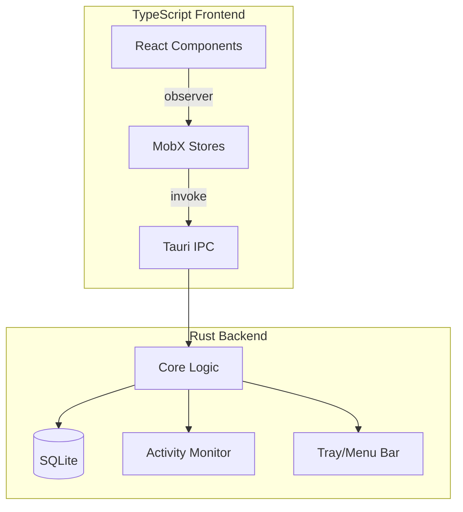

# Work Day Tracker - Application Plan

## Architecture Overview



**Tech Stack**

- **Tauri v2** - Rust backend + web frontend, native menu bar/tray support, cross-platform
- **TypeScript + React** - Frontend UI
- **MobX** - State management (observables, computed values, actions)
- **SQLite** (via `rusqlite`) - Local data persistence
- **chrono** - DateTime handling in Rust

---

## Incremental Implementation (Backend-First, Validate Each Step)

Each slice: **Backend → Unit test → Frontend → Manual validation** before moving on.

### APIs (Tauri Commands)

| # | Command | Purpose | Depends on |
|---|---------|---------|------------|
| 0 | `ping` | Health check – proves backend/frontend wiring works | — |
| 1 | `get_timer_state` | Returns { status, elapsed_seconds } | DB schema |
| 2 | `start_session`, `stop_session` | Create and finalize a work session | get_timer_state |
| 3 | `pause_session`, `resume_session` | Pause/resume active session | get_timer_state |
| 4 | `get_sessions` | List past sessions | DB |
| 5 | `get_settings`, `save_setting` | Read/write settings | DB |
| 6 | `get_weekly_summary` | Actual vs expected hours for week | get_sessions, get_settings |
| 7 | `export_csv` | Export sessions to CSV file | get_sessions |
| 8 | Tray icon | System tray with Show/Quit | — |
| 9 | Auto-pause (idle detection) | Pause when idle, resume on activity | pause/resume (later) |

---

### Slice 0: Project Boot
**Goal:** Minimal Tauri app runs.

- Scaffold Tauri v2 + React + TypeScript
- `npm run tauri dev` opens window
- Frontend displays "Work Day Tracker"

**Validation:** App launches and renders.

---

### Slice 1: Ping ✓
**Goal:** First backend call works.

- Add `ping` command → returns `"pong"`
- Unit test: `ping` returns `"pong"`
- Frontend: "Ping" button that calls command and displays response

**Validation:** Click button → see "pong".

---

### Slice 2: DB + `get_timer_state`
**Goal:** SQLite initializes, returns idle state.

- DB init, `sessions` and `settings` tables
- `get_timer_state` → `{ status: "idle", elapsed_seconds: 0 }`
- Unit tests: DB init, get_timer_state returns idle
- Frontend: Display "Status: idle"

**Validation:** State displays; tests pass.

---

### Slice 3: `start_session` / `stop_session`
**Goal:** Full start/stop cycle.

- `start_session(location)` creates session row
- `stop_session(elapsed_seconds)` sets end_time, duration
- Unit tests: start→running, stop→idle, DB correct
- Frontend: Start and Stop buttons

**Validation:** Start/stop updates UI and DB; tests pass.

---

### Slice 4: `pause_session` / `resume_session`
**Goal:** Pause and resume.

- Pause/resume state in backend
- Unit tests
- Frontend: Pause and Resume buttons

**Validation:** Pause/resume works; tests pass.

---

### Slice 5: Timer UI
**Goal:** Proper timer display.

- Display elapsed time (HH:MM:SS)
- Location picker (Home/Office)
- Layout and styling

**Validation:** Timer reflects state correctly.

---

### Slice 6: `get_sessions`
**Goal:** List past sessions.

- Backend command + unit tests
- Frontend: Session list component

**Validation:** Sessions display; tests pass.

---

### Slice 7: `get_settings` / `save_setting`
**Goal:** Settings persistence.

- Backend: read/write settings
- Unit tests
- Frontend: Settings form

**Validation:** Settings persist; tests pass.

---

### Slice 8: `get_weekly_summary`
**Goal:** Weekly hours summary.

- Backend: compute actual vs expected
- Unit tests
- Frontend: Weekly summary component

**Validation:** Summary correct; tests pass.

---

### Slice 9: Tray Icon
**Goal:** System tray presence.

- Tray icon with Show/Quit menu
- Click opens window

**Validation:** Tray works on macOS/Windows.

---

### Slice 10: `export_csv` ✓
**Goal:** Export to CSV.

- Backend: `get_export_csv_by_fy` groups by Australian financial year (Jul 1–Jun 30), one CSV per FY
- Frontend: Export button, directory picker, writes `work-hours-FY2025.csv` etc
- fs:scope `$HOME/**` for write permissions
- Tests: `test_australian_fy_from_date`, `test_get_export_csv_by_fy_australian_financial_year`

**Validation:** CSV exports correctly; tests pass.

---

## Next Steps (Post-MVP)

Planned features in recommended implementation order:

### 1. Quick log (full day) ✓
**Goal:** Log a full work day at a location without using the timer.

- **Backend:** `log_full_day(date, location, duration_minutes)` – insert completed session directly
- **DB:** Reuse existing `sessions` table; sessions have `end_time` and `duration_minutes` set immediately
- **Frontend:** "Quick log" section in Tracker view – date picker, location, hours (0.25–24). One row per day+location
- **Test:** `test_log_full_day`

**Validation:** Logged days appear in sessions list and export.

---

### 2. Edit logged time (add/remove breaks)
**Goal:** Adjust duration of completed sessions (add break minutes, or reduce).

- **Backend:** `update_session_duration(session_id, new_duration_minutes)` – UPDATE sessions SET duration_minutes = ? WHERE id = ?
- **Frontend:** Edit control on each session row (pencil icon) – modal or inline: "Original: 8h 0m. Add break: +30m → 7h 30m" or "Adjust to: ___ h ___ m"
- **DB:** Maybe add `duration_adjusted` or `break_minutes` column for audit; or keep it simple – just overwrite `duration_minutes` and optionally `notes` ("30m lunch break deducted")
- **Export:** CSV uses the updated `duration_minutes`

**Dependencies:** None. Can build anytime.

---

### 3. Overtime alerts
**Goal:** Alert user on Friday when they've already hit weekly hours; offer "leave early" option.

- **Logic:**
  1. On Friday, when user clicks **Start** → before creating session, check: `actual_minutes_this_week >= expected_minutes`?
  2. If yes → show modal: "You've already hit your weekly target. You can leave X hr early if you'd like. [Yes] [No]"
  3. If **Yes** → store `overtime_leave_early_minutes` (or target time) in settings/session
  4. When timer hits that time → show alert: "Your work week is accomplished!"
  5. If **No** → start session as normal
- **Backend:** `get_overtime_leave_early_minutes()` – returns surplus minutes this week, or 0. `set_leave_early_target(minutes)` – store target (expected - surplus) for today
- **Frontend:** Modal before start (Friday only); listen for timer reaching target and show completion alert
- **Settings:** Could add `enable_overtime_alerts` toggle

**Dependencies:** `get_weekly_summary`, `start_session`. Build after Quick log if desired.

---

### 4. Idle detection (opt-in)
**Goal:** Pause session when user is idle; resume on activity. Opt-in.

- **Backend:** Platform-specific idle detection (macOS: `IOKit`/`CoreGraphics`, Windows: `GetLastInputInfo`). Poll every N seconds or use platform APIs.
- **Settings:** `idle_detection_enabled`, `idle_threshold_minutes` (e.g. 5)
- **Flow:** When idle > threshold and session running → call `pause_session`. When activity detected → call `resume_session`
- **Tray:** Tooltip could show "Paused (idle)" vs "Paused (manual)"
- **Dependencies:** `pause_session`, `resume_session`

**Dependencies:** Pause/resume. Most complex – platform-specific code, background polling.

---

## Recommended order

| Order | Feature        | Complexity | Reason                                      |
|-------|----------------|------------|---------------------------------------------|
| 1     | Quick log      | Low        | Simple insert; no timer logic               |
| 2     | Edit duration  | Low        | Single UPDATE; straightforward UI           |
| 3     | Overtime alerts| Medium     | Modals, Friday check, timer target logic    |
| 4     | Idle detection | High       | Platform APIs, background work, opt-in UX   |

---

## Data Model

| Table        | Purpose                                                                       |
| ------------ | ----------------------------------------------------------------------------- |
| `sessions`   | id, date, start_time, end_time, duration_minutes, location (home/office), notes. Optional: `source` (timer \| quick_log) |
| `settings`   | key, value (expected_hours_per_week, default_location, idle_detection_enabled, idle_threshold_minutes, leave_early_target_minutes) |
| `pause_events` | For audit trail of pauses (optional)                                        |

---

## Test Strategy

| Layer   | Tool           | When                  |
|---------|----------------|-----------------------|
| Rust    | `#[test]`      | Every new command     |
| DB      | `#[test]` + in-memory SQLite | DB/query logic |
| Frontend| Manual (or Playwright later) | After each UI slice |

---

## Project Structure (MVP)

```
work_day_tracker_app/
├── mvp/                    # Incremental MVP (slices 0–10)
│   ├── src/                # React frontend
│   ├── src-tauri/          # Rust backend
│   ├── package.json
│   └── ...
├── v1/                     # Previous full implementation (archived)
├── PLAN.md
└── README.md
```
